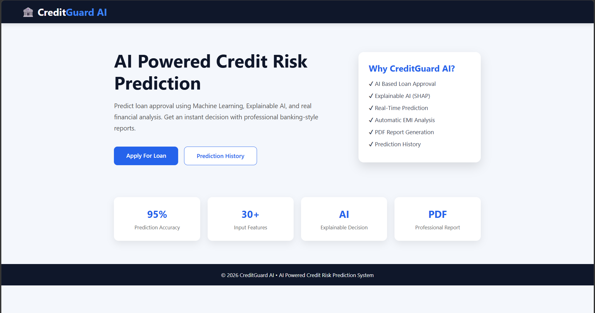
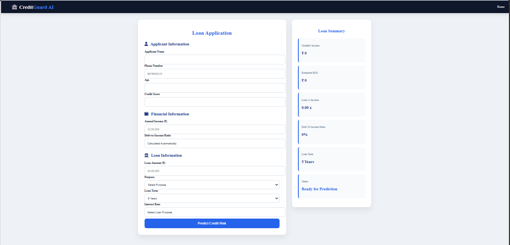
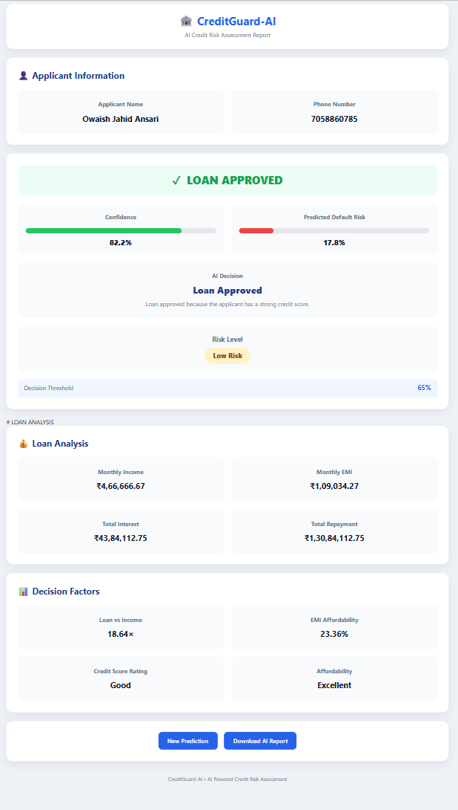
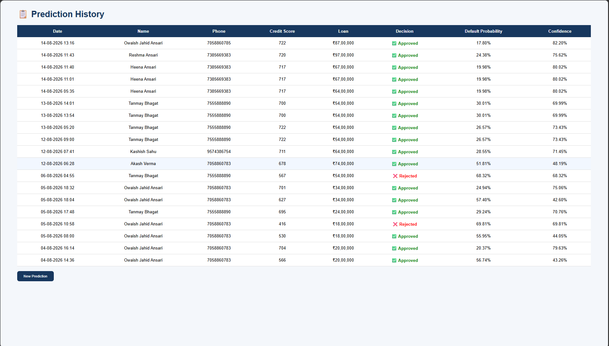

# 🛡️ CreditGuard AI


CreditGuard AI is a machine learning project for predicting loan default risk and presenting the prediction through a Flask web application.

The project uses a trained LightGBM classification model to estimate default probability. The application then applies a configurable decision threshold, performs additional loan and affordability analysis, stores prediction history, provides SHAP-based explanations, and generates a downloadable PDF credit-risk report.

The main goal of the project was to take a machine learning model beyond a notebook and connect it to a complete web application.

## Problem Statement

Loan applications contain several financial and credit-related factors that can affect the possibility of default.

The system needs to:

* Estimate the probability of default
* Apply a decision threshold
* Classify the applicant's risk level
* Analyze loan affordability
* Show the reasoning behind the prediction
* Store previous predictions
* Generate a credit-risk report
* Provide the results through a web interface

CreditGuard AI brings these parts together in one application.

## Key Features

### Credit Risk Prediction

* LightGBM binary classification
* Default probability estimation
* Configurable prediction threshold
* Loan Approved / Loan Rejected decision
* Confidence score
* Low / Medium / High risk classification

### Loan & Financial Analysis

The application calculates additional financial indicators:

* Loan-to-income relationship
* Monthly EMI
* EMI-to-income ratio
* Loan affordability
* Credit profile classification

### SHAP Explainability

The application uses SHAP (SHapley Additive exPlanations) to show which features contribute to the model's prediction.

This makes it possible to inspect the factors behind a prediction instead of displaying only the final result.

### Prediction History

Prediction results are stored using SQLAlchemy with SQLite.

The history page keeps information such as:

* Applicant name
* Phone number
* Credit score
* Loan amount
* Default probability
* Confidence
* Final decision
* Prediction date

### PDF Credit Risk Report

CreditGuard AI can generate a downloadable PDF report containing:

* Applicant information
* Loan details
* Annual income
* Loan amount
* Interest rate
* Loan term
* Monthly EMI
* Loan-to-income relationship
* EMI ratio
* Default probability
* Confidence
* Risk level
* Financial analysis
* AI decision summary

The report uses Indian currency formatting, for example:

`₹92,00,000.00`

### Flask Web Application

The application includes:

* Home page
* Loan application form
* Prediction result page
* Prediction history
* PDF report generation
* Error handling

## Machine Learning Pipeline

```text
Home Credit Data
       │
       ▼
Data Loading
       │
       ▼
Data Cleaning
       │
       ▼
Exploratory Data Analysis
       │
       ▼
Feature Engineering
       │
       ▼
Data Preprocessing
       │
       ▼
LightGBM Training
       │
       ▼
Model Evaluation
       │
       ▼
Threshold Selection
       │
       ▼
Saved Model + Preprocessor + Threshold
       │
       ▼
Flask Application
       │
       ├───────────────┐
       ▼               ▼
Prediction          SHAP Analysis
       │               │
       └───────┬───────┘
               ▼
      Loan & Risk Analysis
               │
               ▼
      Decision + History
               │
               ▼
          PDF Report
```

## System Architecture

```text
                    ┌─────────────────────┐
                    │     User / Client   │
                    └──────────┬──────────┘
                               │
                               ▼
                    ┌─────────────────────┐
                    │    Flask Web App    │
                    │      HTML + CSS     │
                    └──────────┬──────────┘
                               │
                               ▼
                    ┌─────────────────────┐
                    │ Input Validation &  │
                    │    Preparation      │
                    └──────────┬──────────┘
                               │
                               ▼
                    ┌─────────────────────┐
                    │    Preprocessor     │
                    └──────────┬──────────┘
                               │
                               ▼
                    ┌─────────────────────┐
                    │      LightGBM       │
                    │   Risk Prediction   │
                    └──────────┬──────────┘
                               │
                 ┌─────────────┼─────────────┐
                 ▼             ▼             ▼
          Default Prob.   SHAP Analysis   Risk Analysis
                 │             │             │
                 └─────────────┼─────────────┘
                               ▼
                    ┌─────────────────────┐
                    │   Final Decision    │
                    │ Approved / Rejected  │
                    └──────────┬──────────┘
                               │
                 ┌─────────────┼─────────────┐
                 ▼             ▼             ▼
            SQLAlchemy     PDF Report     Result UI
              History      Generation
```

## Prediction Logic

The LightGBM model produces a probability for the default class.

The application compares that probability with the configured threshold.

### Current threshold

```text
Decision Threshold = 0.65
```

The decision rule is:

```text
Default Probability >= 0.65
        │
        ├── Yes → Loan Rejected
        │
        └── No  → Loan Approved
```

For example:

```text
Default Probability = 30%
Decision             = Loan Approved
Confidence           = 70%
```

The default probability and confidence are displayed separately in the application.

* Default probability = estimated probability of belonging to the default class
* Confidence = probability associated with the selected final decision

---

## Model Evaluation

The model was evaluated using:

* ROC-AUC
* Precision
* Recall
* F1-Score
* Confusion Matrix
* ROC Curve

### Test Set Results

| Metric             |      Score |
| ------------------ | ---------: |
| ROC-AUC            | `0.780313` |
| F1-Score           | `0.292687` |
| Precision          | `0.186207` |
| Recall             | `0.683585` |
| Decision Threshold |     `0.65` |

The threshold is configurable and was selected instead of using the default `0.50` classification threshold.

---

## Dataset

The model was developed using the Home Credit Default Risk dataset.

The dataset contains information related to:

* Applicants
* Previous loan applications
* Installment payments
* Credit cards
* Bureau records
* Bureau balance
* POS cash balance
* Credit-related and behavioral features

The project combines information from multiple credit-data sources during feature engineering.

---

## Feature Engineering

Feature engineering was performed using several Home Credit data sources:

* Bureau
* Bureau Balance
* Previous Applications
* POS Cash Balance
* Credit Card Balance
* Installment Payments

The resulting features are merged into the modeling dataset and passed through the trained preprocessing pipeline.

---

## Explainable AI with SHAP

SHAP is used to inspect the contribution of individual features to the model prediction.

This helps answer questions such as:

* Which features increased the estimated risk?
* Which features reduced the estimated risk?
* Why did the model produce a particular prediction?

The SHAP component is integrated into the application rather than being used only during experimentation.

---

## Prediction History

Prediction results are stored using SQLAlchemy.

The history page allows previously submitted applications to be reviewed.

Example stored information:

```text
Applicant
Phone
Credit Score
Loan Amount
Default Probability
Confidence
Decision
Prediction Date
```

##  AI Credit Risk Report

A sample PDF report is included in the repository.

### Sample Report

[ View Sample AI Credit Risk Report](Reports/sample_credit_risk_report.pdf)

The generated report contains the applicant's financial information, prediction result, risk assessment, affordability analysis, and decision summary.

## Screenshots

### Home Page



### Loan Application



### AI Prediction Result



### Prediction History



## Tech Stack

### Programming

* Python

### Machine Learning

* LightGBM
* Scikit-learn
* Pandas
* NumPy

### Explainability

* SHAP

### Backend

* Flask
* Gunicorn

### Database

* SQLAlchemy
* SQLite

### PDF Generation
* ReportLab

### Development & Experimentation

* Jupyter Notebook
* MLflow

### Deployment
* Render

## 📁 Project Structure

```text
CreditGuard-AI/
│
├── models/
│   ├── feature_names.json
│   ├── lightgbm_model.pkl
│   ├── preprocessor.pkl
│   └── threshold.pkl
│
├── notebooks/
│   ├── 01_Data_Loading.ipynb
│   ├── 02_EDA.ipynb
│   ├── 03_Feature_Engineering_.ipynb
│   ├── 04_model_training.ipynb
│   ├── 05_MLflow Tracking.ipynb
│   └── 06_Flask Credit Risk Prediction Web App.ipynb
│
├── Reports/
│   └── sample_credit_risk_report.pdf
│
├── screenshots/
│   ├── home.png
│   ├── loan_application.png
│   ├── prediction_result.png
│   └── prediction_history.png
│
├── fonts/
│   ├── DejaVuSans.ttf
│   └── DejaVuSans-Bold.ttf
│
├── src/
│   ├── config/
│   ├── database/
│   ├── feature_engineering/
│   ├── models/
│   ├── services/
│   └── utils/
│
├── static/
├── templates/
│
├── app.py
├── create_database.py
├── Procfile
├── requirements.txt
└── README.md
```

## Installation

### 1. Clone the repository

```bash
git clone https://github.com/OwaishAnsari05/CreditGuard-AI.git
cd CreditGuard-AI
```

### 2. Create a virtual environment

#### Windows

```powershell
python -m venv venv
venv\Scripts\activate
```

#### macOS / Linux

```bash
python3 -m venv venv
source venv/bin/activate
```

### 3. Install dependencies

```bash
pip install -r requirements.txt
```

### 4. Initialize the database

```bash
python create_database.py
```

### 5. Run the application

```bash
python app.py
```

The application will be available at:

```text
http://127.0.0.1:5000
```

## Deployment

The Flask application is deployed on Render using Gunicorn.

Production start command:

```bash
gunicorn app:app
```

The deployed application is available through the Render URL configured for the project.

## Environment Variables

Environment-specific configuration can be supplied through environment variables.

Example:

```text
DATABASE_URL=...
SECRET_KEY=...
```

The current local application uses SQLite for prediction history.

##  Current Limitations

* SQLite is currently used for prediction history.
* The project is intended for educational and portfolio use.
* Predictions should not be used as real-world lending decisions.
* Model performance depends on the training dataset and the data provided to the model.
* The current deployment is not intended to represent a production banking system.

## Future Improvements

Possible next improvements include:

* PostgreSQL for production database storage
* Authentication and user roles
* Cloud storage for generated reports
* Automated model retraining
* Improved audit logging

## Author

Owaish Ansari

BCCA — Bachelor of Commerce in Computer Applications
Nagpur, Maharashtra, India

## Disclaimer

CreditGuard AI is an educational and portfolio project.

The predictions generated by the application are not intended to replace professional financial or lending decisions.
